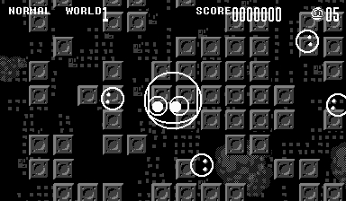
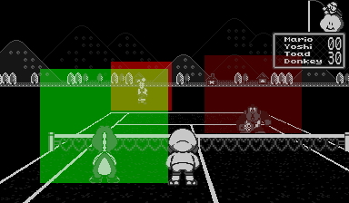

* TOC
{:toc}

This document explores the performance characteristics of the Virtual Boy's graphics chip,
the Virtual Image Processor (VIP).

The VIP is largely tile-based, similar to previous
consoles such as the NES and Sega Genesis. However, unlike these systems which generate
the image as it is being transmitted to the display, the Virtual Boy renders onto a framebuffer,
the contents of which is then transmitted to the display. Due to this, there is no strict
time limit on how long images take to generate. The removal of this restraint meant
the VIP was able to render images so complex they might take multiple display frames to render,
which some games did.

This page uses terminology from Guy Perfect's
[Virtual Boy Sacred Tech Scroll](http://perfectkiosk.net/stsvb.html#vip).
Timing is described in terms of clock cycles, running at 20MHz. Note that the Virtual Boy's display
runs at approximately 50Hz, so an image that takes more than roughly 400,000 cycles to render
will spill over into the next frame.

While I've tried to ensure all numbers are as accurate as possible, a few are likely incorrect.
For this reason, this page is published via [GitHub](https://github.com/skyfloogle/vip-timing),
to allow changes to be proposed in pull requests.

## Method
A Virtual Boy ROM was created to perform the measurements.
In this program, a scene is configured, and the time it takes to draw is measured.
When the `GAMESTART` interrupt is fired, the hardware timer is set to its maximum value.
During drawing, this timer ticks down, and when the `XPEND` interrupt is fired,
the timer is read.
The resulting number indicates how long the drawing procedure took, in units of
20μs, or 400 clock cycles at 20MHz.

When the same scene is drawn multiple times, this number fluctuates for currently
unknown reasons. As a result, the average of a number of recordings can be taken
to increase the measurement's accuracy.
Unless otherwise specified, for the purpose of this research, 400 measurements were
taken and added together, to express the draw time in clock cycles.

Despite this improved accuracy, some random variance of roughly 20 cycles was observed.
Various workarounds were used to combat this. For example, where possible,
all 32 worlds were set up identically, so that the difference between configurations
would vary by less than one cycle per world. Where this was not possible,
hundreds of measurements were made and averaged to get a somewhat accurate number.
However, that does not mean these numbers are definitive. Retrieving more precise numbers
would likely require tapping the VIP's pins, or decapping the VIP and reverse engineering
it with an electron microscope, as has been done for other systems such as the SNES.

Additionally, I observed that when large cycle counts were measured, they tended to drift
upwards, such that every roughly 300~400 cycles, another cycle would be added.
The larger numbers below represent my raw observations, and have not had cycles
subtracted to account for this.

As discussed later, the Virtual Boy draws its graphics in 8-pixel strips.
While it would be possible to use the `SBHIT` interrupt to measure the duration of each
strip, I did not do so for the purpose of this document, as this information is not
needed for accurate game emulation. However, it could be interesting to do so as a future
project, as it could shed some light on why some numbers are what they are.

## Observations
When all worlds are disabled (i.e. world 31 is marked as `END`), the Virtual Boy
takes 54996 cycles to render the blank image. This includes the cost of
identifying an `END` world (described below), which means the base cost of rendering is
54688 cycles. This is the only number I can't measure relative to something else,
and therefore one of the numbers I have the least confidence in.
However, the true number is unlikely to be off by more than a few hundred clock cycles.

While rendering is entirely single-threaded, the VIP may perform multiple independent
operations in one clock cycle.

Tile content does not affect performance, i.e. transparent
tiles take just as long to draw as opaque ones. World size (`SCX` and `SCY`),
as well as which background maps are displayed, also has no effect.

The Virtual Boy has two displays, each of which has its own framebuffer.
Both framebuffers are rendered simultaneously, so while worlds or objects may only
be visible on one display, this takes just as long as if they were visible on both.

Each framebuffer is 384x224 pixels in size. The VIP divides these into **strips**:
segments which cover the entire width of the framebuffer, but are 8 pixels tall.
The VIP contains enough internal memory to store one strip for both eyes (later referred to
as the **internal framebuffer**).
After each of the 28 strips is rendered, they are transferred to the main framebuffers,
and rendering of the next strip begins. Each strip a world appears on adds to its
performance cost. However, the cost per strip is discussed in a separate section,
as there are various quirks that would make the main section harder to read if included.

Within each strip, the Virtual Boy renders each of the 32 worlds in sequence,
until an `END` world is encountered (or the 32nd world is rendered). Identifying the `END`
world and aborting takes 308 clock cycles, which does not occur when all 32 worlds are present.

Dummy worlds simply cost 561 cycles.

Rendering is done largely in terms of 1-pixel **rows**, so rows that are above or below the
current strip are generally not considered. However, background worlds that are located
fully below some strips have an additional cost.

It is important to note that tiles are 8x8 bitmaps, where one halfword corresponds to
one row of pixels. Often, an entire row of a tile will be drawn at once.

Within each row, the full width of the world is considered, regardless of whether
the world is off of the left or right edges of the screen.

In programming guides, world types are generally explored in the order
normal, H-Bias, affine, object. However, here we will describe the background modes
in reverse order, as this allows each section to build on the previous one.

### Affine
Affine worlds are one of the more complex world types. However, as a result of their
complexity, their performance characteristics are the simplest to describe, as every pixel
is calculated mostly independently. The additional affine parameters have no effect on
performance.

Each affine world has a base cost of 908 cycles.

Affine worlds are rendered one row at a time, each one adding 80 cycles to the performance cost.
Within each row, each pixel costs 4 cycles. This number alone contributes most of the cost of
affine worlds: if everything else was free, a full-screen affine world, which
would cover 86,016 pixels, would take 344,064 cycles to render, or 86.016% of the frame budget.

For each pixel, the VIP must:
* Read the cell from the background map corresponding to this pixel
* Read the tile data covering that pixel, taking horizontal and vertical flipping into account
* Take the appropriate colour from the appropriate palette
* Output this colour into the internal framebuffer
* Increment the X and Y coordinates using `DX` and `DY`
* Identify whether all pixels of the row have been drawn, and quit if so

In order to fit this all into four clock cycles, the VIP must perform several of these operations
in parallel using specialized circuitry.

### H-Bias
H-Bias and normal worlds have an additional limitation not shared by affine worlds: if `GY` is located
within a given strip, the entire portion of that strip below `GY` will be covered by the world, even if
`H` indicates the world should be shorter. For example, if `GY` is 3 and `H` is 2, the world will be
5 pixels tall, even though `H` indicates it should be shorter.

H-Bias worlds have a base cost of 880 cycles.

Like affine worlds, H-Bias worlds are rendered one row at a time, each row adding 98 cycles.
While this number is higher than that of affine maps, this is mitigated by additional optimizations.
Because H-Bias worlds cannot be scaled, entire tiles can be drawn at once. Every tile covered by the world
costs 4 cycles per row, regardless of how much of it is visible.

Note that unlike with affine worlds, the additional parameters do affect performance, as they may change
how many tiles are visible in a given row.

In both H-Bias and normal worlds, when the effective `MP` value is non-zero, all tiles between the furthest left
and the furthest right are considered, even if they would not be displayed. For example, if `MX` is 0, `MP` is 200, and
`W` is 5, 51 tiles will be processed, despite the world's small size.

### Normal
While normal worlds are the simplest to explain in programming guides, they have some of the most complex
performance characteristics, due to the large number of optimizations possible with them.

Normal worlds have a base cost of 880 cycles.

Normal worlds are not rendered on row at a time. Rather, they are rendered in terms of rows of tiles,
within which each tile is rendered top-to-bottom. The below animation illustrates a scenario where
some tiles are vertically offset by a few pixels, such that they don't align with the strip:

{: style="image-rendering:pixelated;width:20em" }

Each row of tiles within a strip costs 91 cycles. Each tile costs 2 cycles, and every row within that tile
costs an additional 2 cycles. In other worlds, at its fastest, the Virtual Boy can render 8 pixels on both
framebuffers in 2 cycles.

### Objects
Object worlds are somewhat separated from background worlds. Most world attributes are ignored for object worlds.
This means that they always cover the entire screen. However, some of the same rules still apply:
objects that are off-screen horizontally count as if they were on-screen, while objects that are off-screen vertically
don't. The visibility flags (`JLON` and `JRON`) have no effect on performance, even if the object is invisible.

Each object world has a base cost of 757 cycles. Every object world decrements an internal counter, which starts at 3.
Every world following an underflow, i.e. every fourth world starting with the fifth, costs an additional 28896 cycles.
I wasn't able to get an exact value for this number, it seems to vary by up to 50-ish cycles in either direction.
Fortunately, this doesn't come up in practice, as there is no useful reason to draw more than four object layers.

Each object costs 1 cycle for every strip it doesn't appear on.
Every strip it does appear on costs 42 cycles.
If the top row of the object is not visible on a strip,
it costs an additional 5 cycles.
Finally, every visible row of the strip costs 2 cycles.

Therefore, an object which is visible and vertically aligned to a strip will cost 86 cycles, while a fully visible
yet non-aligned object will cost 133 cycles. Invisible objects cost 28 cycles in total.

## Per-strip costs
In the interest of keeping things simple, the cost per strip was omitted
in the above description. This is because the calculation for this is rather
complicated, for unclear reasons. However, these numbers have been verified.

### Normal and H-Bias
* Each strip has a base cost of 16 cycles.
* If a strip contains the top row of the world, it costs 4 cycles less.
* If a strip contains the bottom row of the world (and not the top row),
it instead costs 3 cycles less.
* If the world is partly off the top of the screen,
and the on-screen portion is only 1 strip tall,
an additional 6 cycle penalty is incurred.
* If the world is partly off the top of the screen,
and the on-scren portion is at least 2 strips tall,
the additional penalty is only 4 cycles.
* Each strip that the world is fully below costs an additional 5 cycles.
* If the world is fully off the bottom of the screen, the cost is **reduced**
by 1 cycle. In other words, the bottom strip costs 4 cycles instead of 5.
* If the world is on or below the bottom strip, the cost is **reduced** by 9 cycles.

### Affine
* Each strip has a base cost of 14 cycles.
* If a strip contains the top row of the world, it costs 1 cycle less.
* If a world is partly off the top of the screen,
an additional 5 cycle cost is incurred.
* If a world is partly off the bottom of the screen, an additional
3 cycle cost is incurred.
* Each strip that the world is fully below costs an additional 5 cycles.
* If the world is fully off the bottom of the screen, an additional 2 cycles
are added.
* If the world is on or below the bottom strip, the cost is **reduced** by 12 cycles.

## Interesting examples
The VIP render time has been made visible in [Red Viper](https://github.com/skyfloogle/red-viper/blob/master/source/common/video_common.c).
A few interesting effects this has on games are explored below.

### Games with full-screen affine layers
{: style="image-rendering:pixelated;width:768px" }

If an affine layer covers the entire screen, drawing it will not fit within the frame budget.
For example, the unreleased Bound High uses one affine layer to render the main gameplay area,
and tile and sprite layers for everything else. Knowing that this would always take more than
one frame to draw, the developers set `FRMCYC` to 1, so that the game targeted 25FPS.
Teleroboxer's title screen, similarly, uses a full-screen zoom effect and sets `FRMCYC` accordingly.

However, some games featured a full-screen affine layer while leaving `FRMCYC` at 0. In particular,
this applies to some company logos in the intros of Innsmouth No Yakata and
Space Invaders Virtual Collection. The game processing waits for the drawing routine to complete
before proceeding, so that the intros effectively run at half the speed they are "programmed" to.

### Mario's Tennis
{: style="image-rendering:pixelated;width:768px" }

This game sets `FRMCYC` to 1 during gameplay, so the game targets 25FPS (half the usual framerate).
The tennis court, net, and non-player characters are all rendered using affine layers.
During singles gameplay, render time stays well within the frame budget. However, during doubles,
there are three non-player characters on the field, so depending on how these are positioned,
render time can easily run over 400k. The developers will have targeted 25FPS to ensure a more
consistent experience.

However, the layers for the NPCs are significantly larger than they need
to be, as illustrated in the image above. If they had cut the unused space from these layers,
maybe targeting 50FPS would have been possible.

With that said, the title screen would certainly still have been limited to 25FPS: a separate render of the
logo was made for each eye, each of which is on its own affine layer. With the court, net, and two
logos, the resulting frame time is well over 400k.

### Golf
{: style="image-rendering:pixelated;width:768px" }

The most interesting thing about Golf, as far as VIP performance concerned, is the level select screen.
This displays a spinning bird's-eye view of the course, including its trees.
While the trees may look like simple sprites, they are in fact rendered in bulk as four large affine planes,
on top of the existing one for the ground. This leads to the scene taking over a million cycles to render,
or approximately 2.5 frames worth of render time.
Because the developers did not set `FRMCYC`, the map rotates a third as fast on hardware, compared to
past emulators.

During gameplay, the VIP is only used for rendering hills in the background. Because of this, like most other
software-rendered Virtual Boy games, the VIP load is very light, with the hills rendering in under 60 thousand cycles.

### Jack Bros.
{: style="image-rendering:pixelated;width:768px" }

In this game, the level transitions involve Jack jumping down from one maze to the next.
When jumping down, the maze Jack jumped from disappears, and the two following mazes are visible.
These zoom into view, using full-screen affine layers. Each maze uses two layers, as the walls
are closer to the camera. This means the transitions feature four full-screen affine layers.
On top of that, the transition contains 3 full-screen normal worlds, 3 object worlds (with one object each),
and 22 dummy worlds. All together, this takes over 1.6 million cycles to render
taking over 1.6 million cycles to render, or 4 frames worth of render time.
As a result, the cutscene runs at 10 frames per second.
This is the most expensive scene in any commercial Virtual Boy game.
Two of the normal worlds contain only transparent tiles. Had they been made dummy worlds, the cutscene might have
been able to run at 12.5 frames per second.

Interestingly, the developers seem to have decoupled render time from processing logic, such that
on past emulators, the transition runs at the same speed while appearing smoother, rather than 
running too fast.
